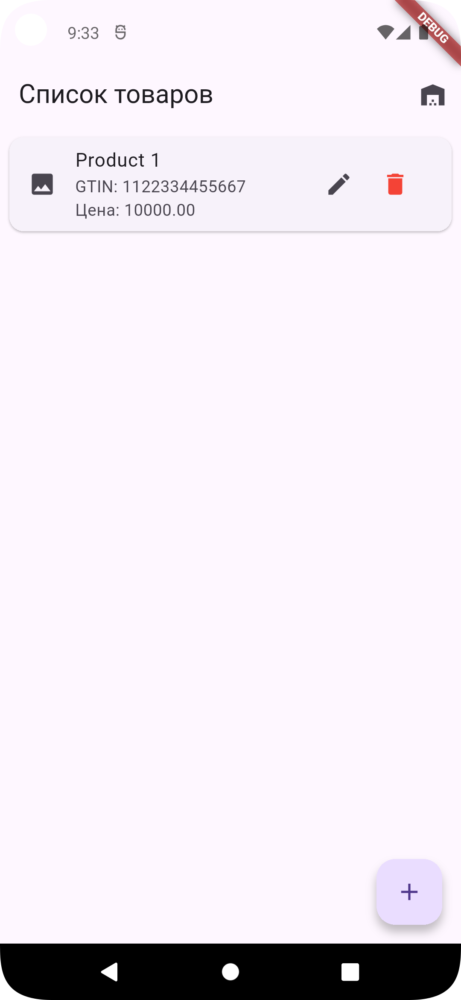
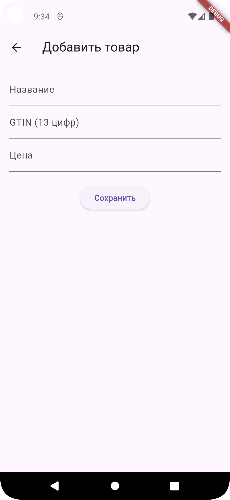
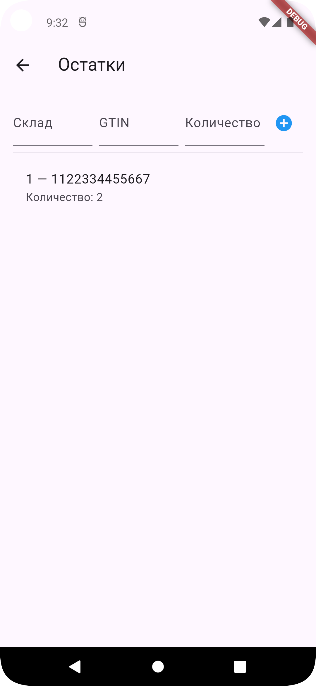
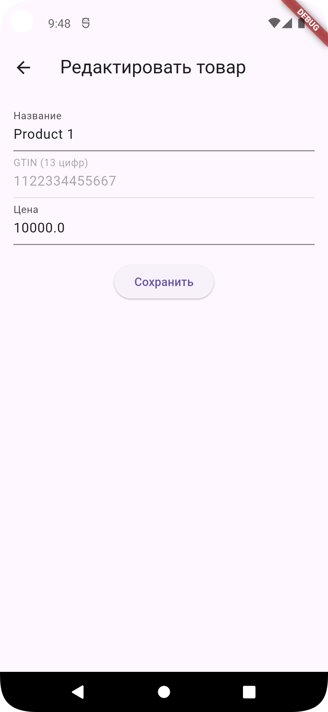
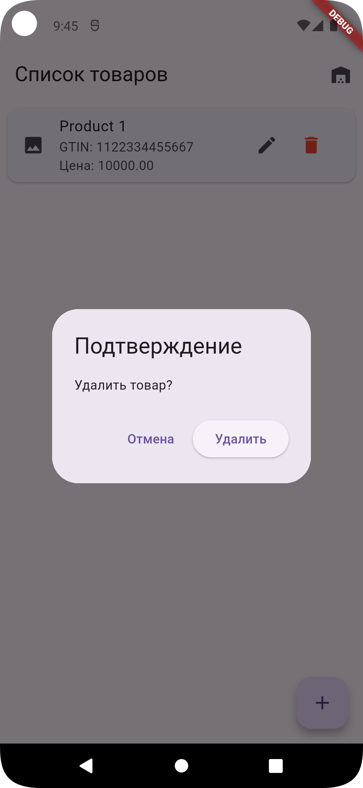
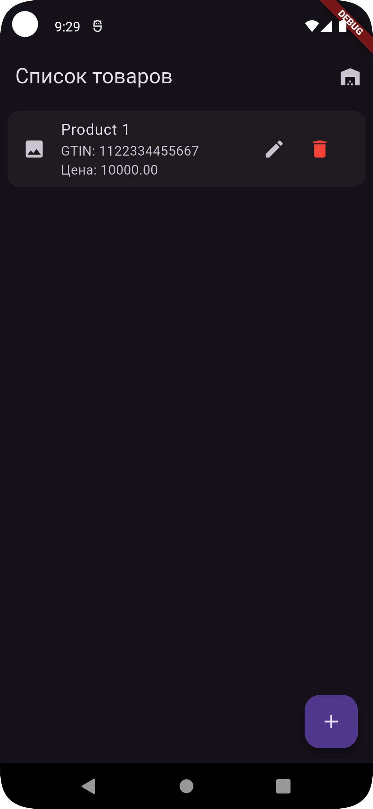
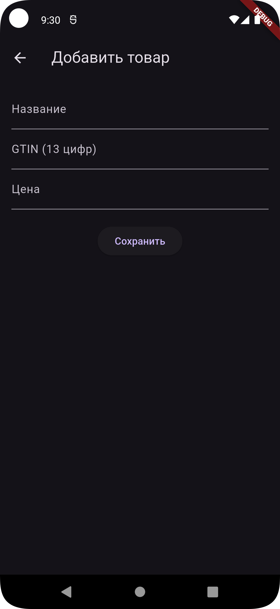
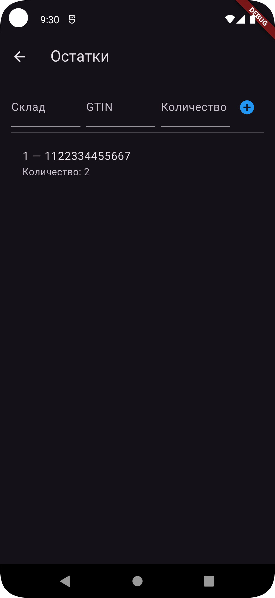
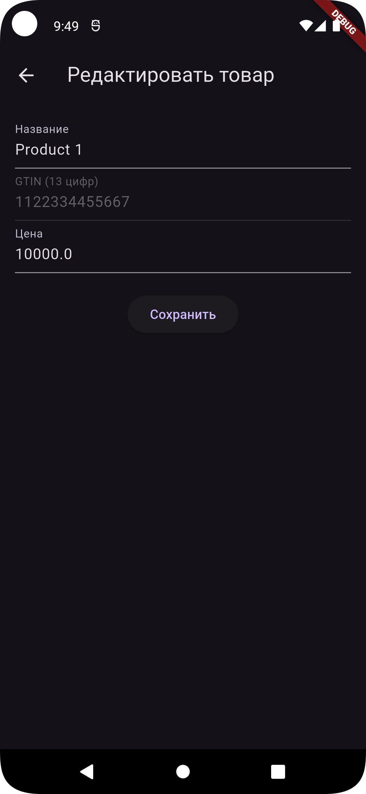
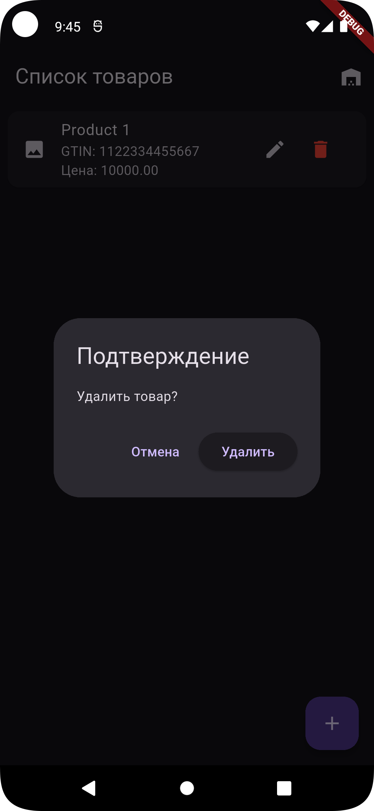

# Dmark Mobile Internship — Тестовое задание (Flutter)
Приложение позволяет пользователю добавлять, редактировать и удалять товары.

## Что реализовано
- [x] Добавление товара (GTIN 13, валидация).
- [x] Редактирование товара.
- [x] Удаление товара (логическое, with deletedAt).
- [x] Просмотр списка товаров (название, цена, дата).
- [x] Сортировка по дате / названию.
- [x] Добавление и учёт остатков (склад, GTIN, количество) — если запись существует, увеличиваем количество.
- [x] Данные сохраняются локально (Hive) и восстанавливаются при запуске.
- [x] (Бонус) Возможность переключения между светлой и тёмной темой.
- [ ] (Бонус) Добавление изображения товара.
- [ ] (Бонус) Поиск по GTIN.
- [ ] (Бонус) Уменьшение остатков/удаление со склада.

## Скриншоты

### Светлая тема

| Список товаров                                          |  Добавление товара                                              | Остатки на складе                                   |
|------------------------------------------------------------|------------------------------------------------------------------|--------------------------------------------------------|
|  |  |  |

| Редактирование товара                                           |  Подтверждение удаления                                             |
|--------------------------------------------------------------------|------------------------------------------------------------------------|
|  |  |


### Тёмная тема

|  Список товаров                                       |  Добавление товара                                           |  Остатки на складе                                |
|---------------------------------------------------------|---------------------------------------------------------------|-----------------------------------------------------|
|  |  |  |

| Редактирование товара                                        |  Подтверждение удаления                                          |
|-----------------------------------------------------------------|---------------------------------------------------------------------|
|  |  |

## Как запустить
1. Клонировать репозиторий:
   ```bash
   git clone https://github.com/buzurg2003/demo.git
   cd demo
